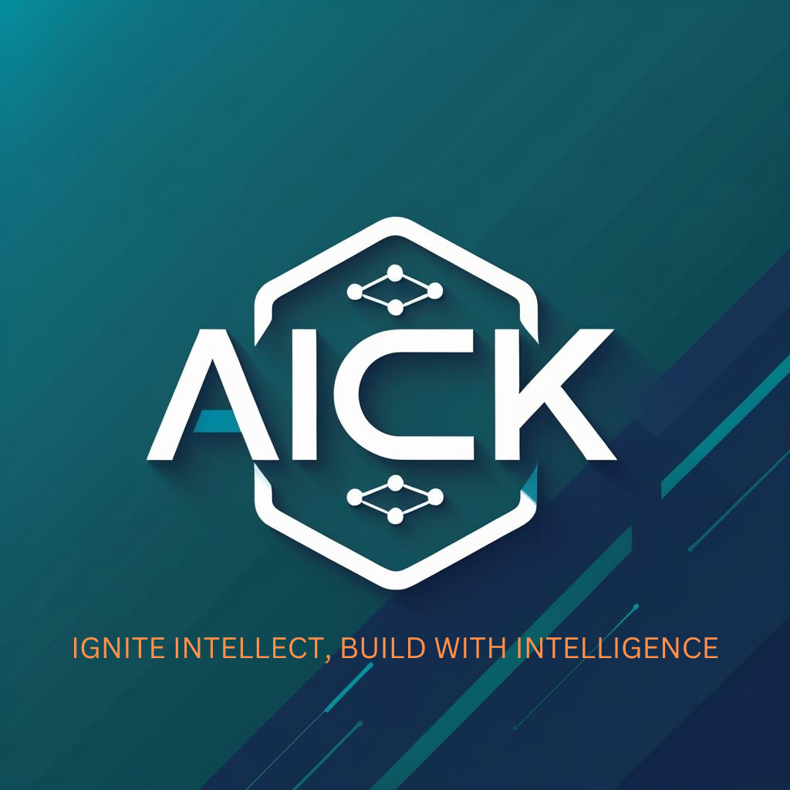

# AICK Studio Abandoned Cart Recovery Agent



**An Intelligent Agentic AI Solution for E-commerce Cart Recovery**

---

## 🚀 Overview

The AICK Studio Abandoned Cart Recovery Agent is a sophisticated, AI-powered solution designed to automatically recover abandoned shopping carts through intelligent, personalized email campaigns. Built with cutting-edge technologies including LangGraph for agent orchestration, OpenAI GPT-4 for message generation, and a modern React dashboard for monitoring and management.

### Key Features

- **🤖 Intelligent Agent Workflow**: LangGraph-powered agentic system that observes, analyzes, and acts on abandoned carts
- **📧 Personalized Email Generation**: GPT-4 powered message creation tailored to individual customers and cart contents  
- **📊 Real-time Dashboard**: Beautiful React interface with comprehensive analytics and monitoring
- **🔗 Shopify Integration**: Seamless connection to Shopify stores via Admin API
- **📈 Advanced Analytics**: Detailed recovery metrics, email engagement tracking, and performance insights
- **⚡ Real-time Monitoring**: Live tracking of customer return activity and email interactions
- **🎨 AICK Studio Branding**: Custom-designed interface reflecting premium brand identity

## 🏗️ Architecture

The system follows a modern microservices architecture with clear separation of concerns:

```
┌─────────────────┐    ┌─────────────────┐    ┌─────────────────┐
│   React         │    │   FastAPI       │    │   LangGraph     │
│   Dashboard     │◄──►│   Backend       │◄──►│   Agent         │
│                 │    │                 │    │                 │
└─────────────────┘    └─────────────────┘    └─────────────────┘
         │                       │                       │
         │                       │                       │
         ▼                       ▼                       ▼
┌─────────────────┐    ┌─────────────────┐    ┌─────────────────┐
│   Browser       │    │   API Routes    │    │   Node          │
│   Interface     │    │   & Webhooks    │    │   Functions     │
└─────────────────┘    └─────────────────┘    └─────────────────┘
                                │                       │
                                │                       │
                                ▼                       ▼
                    ┌─────────────────┐    ┌─────────────────┐
                    │   External      │    │   State         │
                    │   APIs          │    │   Management    │
                    │                 │    │                 │
                    │ • Shopify       │    │ • Cart Data     │
                    │ • SendGrid      │    │ • Customer Info │
                    │ • OpenAI        │    │ • Recovery      │
                    └─────────────────┘    │   Attempts      │
                                          └─────────────────┘
```

## 🛠️ Technology Stack

### Backend
- **LangGraph**: Agent workflow orchestration and state management
- **FastAPI**: High-performance API framework with automatic documentation
- **Python 3.11+**: Modern Python with async/await support
- **Pydantic**: Data validation and serialization
- **OpenAI GPT-4**: AI-powered message generation
- **SendGrid**: Reliable email delivery service
- **SQLAlchemy**: Database ORM (optional for persistence)

### Frontend  
- **React 19**: Modern React with hooks and concurrent features
- **Vite**: Lightning-fast build tool and dev server
- **Tailwind CSS**: Utility-first CSS framework
- **shadcn/ui**: High-quality React component library
- **Recharts**: Beautiful, composable charts for React
- **Lucide React**: Consistent icon library
- **Framer Motion**: Smooth animations and transitions

### External Integrations
- **Shopify Admin API**: Cart and customer data retrieval
- **SendGrid API**: Email delivery and engagement tracking  
- **OpenAI API**: GPT-4 powered content generation

## 📋 Prerequisites

Before setting up the project, ensure you have:

- **Node.js 20+** and **npm/pnpm** for frontend development
- **Python 3.11+** and **pip** for backend development  
- **Shopify Store** with Admin API access
- **SendGrid Account** for email delivery
- **OpenAI API Key** for GPT-4 access

## ⚙️ Installation & Setup

### 1. Clone the Repository

```bash
git clone https://github.com/aick-studio/abandoned-cart-agent.git
cd abandoned-cart-agent
```

### 2. Backend Setup

```bash
# Navigate to backend directory
cd backend

# Create virtual environment
python -m venv venv
source venv/bin/activate  # On Windows: venv\Scripts\activate

# Install dependencies
pip install -r requirements.txt
```

### 3. Frontend Setup

```bash
# Navigate to frontend directory  
cd frontend/aick-cart-dashboard

# Install dependencies
npm install
# or
pnpm install
```

### 4. Environment Configuration

Copy the example environment file and configure your API keys:

```bash
cp .env.example .env
```

Edit `.env` with your actual configuration:

```env
# Shopify Configuration
SHOPIFY_SHOP_URL=your-shop.myshopify.com
SHOPIFY_ACCESS_TOKEN=your_shopify_access_token
SHOPIFY_API_VERSION=2023-04

# OpenAI Configuration  
OPENAI_API_KEY=your_openai_api_key
OPENAI_MODEL=gpt-4

# SendGrid Configuration
SENDGRID_API_KEY=your_sendgrid_api_key
SENDGRID_FROM_EMAIL=noreply@aickstudio.com
SENDGRID_FROM_NAME=AICK Studio

# Application Configuration
APP_HOST=0.0.0.0
APP_PORT=8000
FRONTEND_URL=http://localhost:5173
CART_ABANDONMENT_MINUTES=15
```

## 🚀 Running the Application

### Development Mode

**Start the Backend:**
```bash
cd backend
python -m uvicorn api.main:app --reload --host 0.0.0.0 --port 8000
```

**Start the Frontend:**
```bash  
cd frontend/aick-cart-dashboard
npm run dev --host
```

The application will be available at:
- **Frontend Dashboard**: http://localhost:5173
- **Backend API**: http://localhost:8000
- **API Documentation**: http://localhost:8000/api/docs

### Production Deployment

The application is designed for easy deployment to cloud platforms. See the deployment section for detailed instructions.

## 📖 Usage Guide

### Dashboard Navigation

The React dashboard provides four main sections:

1. **Dashboard**: Overview statistics and trend charts
2. **Cart Viewer**: Detailed view of abandoned carts with customer information
3. **Message Generator**: AI-powered email content creation and preview
4. **Analytics**: Advanced metrics and recovery performance analysis

### API Endpoints

The FastAPI backend provides comprehensive REST endpoints:

- `POST /api/agent/start-recovery` - Trigger the recovery workflow
- `POST /api/agent/recover-cart` - Recover a specific cart
- `GET /api/agent/status/{thread_id}` - Get workflow status
- `GET /api/dashboard/stats` - Retrieve dashboard statistics
- `GET /api/dashboard/carts` - List abandoned carts
- `POST /api/webhooks/shopify/cart-update` - Shopify webhook handler
- `POST /api/webhooks/sendgrid/events` - SendGrid event webhook

### LangGraph Workflow

The agent follows a structured workflow:

1. **Observe**: Monitor Shopify for abandoned carts (15+ minutes inactive)
2. **Retrieve**: Fetch detailed cart and customer information
3. **Plan**: Generate personalized recovery message using GPT-4
4. **Act**: Send email via SendGrid with tracking enabled
5. **Monitor**: Track email engagement and return activity

## 🔧 Configuration Options

### Cart Abandonment Settings

- `CART_ABANDONMENT_MINUTES`: Time threshold for considering a cart abandoned (default: 15)
- `SHOPIFY_API_VERSION`: Shopify API version to use (default: 2023-04)

### Email Configuration

- `SENDGRID_FROM_EMAIL`: Sender email address
- `SENDGRID_FROM_NAME`: Sender display name
- Email templates are automatically generated with AICK Studio branding

### AI Message Generation

- `OPENAI_MODEL`: GPT model to use (default: gpt-4)
- Message generation considers customer history, cart value, and product details
- Automatic tone adjustment based on customer segment

## 📊 Analytics & Monitoring

The system provides comprehensive analytics including:

- **Recovery Rate**: Percentage of successfully recovered carts
- **Email Engagement**: Open rates, click rates, and bounce tracking
- **Revenue Impact**: Total revenue recovered through the system
- **Customer Segmentation**: Performance across different customer types
- **Trend Analysis**: Historical performance and seasonal patterns

## 🔗 Integrations

### Shopify Integration

The system integrates with Shopify through:
- **Admin API**: Cart and customer data retrieval
- **Webhooks**: Real-time cart update notifications
- **Checkout Recovery**: Direct links back to abandoned carts

### SendGrid Integration

Email functionality includes:
- **Transactional Emails**: Reliable delivery infrastructure
- **Event Tracking**: Open, click, bounce, and unsubscribe events
- **Template Management**: Dynamic content generation
- **Deliverability Optimization**: Built-in best practices

### OpenAI Integration

AI-powered features:
- **GPT-4 Message Generation**: Contextual, personalized email content
- **Dynamic Personalization**: Customer-specific messaging
- **A/B Testing Support**: Multiple message variations
- **Tone Optimization**: Automatic adjustment based on customer data

## 🧪 Testing

### Mock Data Testing

The system includes comprehensive mock data for development and testing:

```bash
# Test with mock data
cd backend
python -c "
from agent import run_abandoned_cart_recovery
import asyncio
result = asyncio.run(run_abandoned_cart_recovery(use_mock=True))
print(result)
"
```

### API Testing

Use the interactive API documentation at `http://localhost:8000/api/docs` to test endpoints directly.

### Frontend Testing

The React dashboard includes mock data visualization and can operate independently of the backend for UI testing.

## 🚀 Deployment

### Backend Deployment

The FastAPI backend can be deployed to various platforms:

**Docker Deployment:**
```dockerfile
FROM python:3.11-slim
WORKDIR /app
COPY backend/requirements.txt .
RUN pip install -r requirements.txt
COPY backend/ .
CMD ["uvicorn", "api.main:app", "--host", "0.0.0.0", "--port", "8000"]
```

**Cloud Platforms:**
- **Heroku**: Direct deployment with Procfile
- **AWS Lambda**: Serverless deployment with Mangum
- **Google Cloud Run**: Containerized deployment
- **DigitalOcean App Platform**: Simple git-based deployment

### Frontend Deployment

The React frontend builds to static files for easy deployment:

```bash
cd frontend/aick-cart-dashboard
npm run build
```

Deploy the `dist/` folder to:
- **Vercel**: Automatic deployment from git
- **Netlify**: Drag-and-drop or git integration  
- **AWS S3 + CloudFront**: Static hosting with CDN
- **GitHub Pages**: Free hosting for public repositories

## 🔒 Security Considerations

- **API Keys**: Store securely in environment variables, never in code
- **Webhook Verification**: Validate Shopify webhook signatures
- **CORS Configuration**: Restrict origins in production
- **Rate Limiting**: Implement API rate limiting for production use
- **Data Privacy**: Ensure compliance with GDPR and other regulations

## 🤝 Contributing

We welcome contributions to improve the AICK Studio Abandoned Cart Recovery Agent:

1. Fork the repository
2. Create a feature branch (`git checkout -b feature/amazing-feature`)
3. Commit your changes (`git commit -m 'Add amazing feature'`)
4. Push to the branch (`git push origin feature/amazing-feature`)
5. Open a Pull Request

## 📄 License

This project is licensed under the MIT License - see the [LICENSE](LICENSE) file for details.

## 🆘 Support

For support and questions:

- **Documentation**: Check this README and inline code documentation
- **Issues**: Open a GitHub issue for bugs or feature requests
- **Email**: Contact support@aickstudio.com for enterprise support

## 🙏 Acknowledgments

- **LangGraph Team**: For the excellent agent framework
- **OpenAI**: For GPT-4 API access
- **Shopify**: For comprehensive e-commerce APIs
- **SendGrid**: For reliable email infrastructure
- **React Community**: For the amazing ecosystem of tools and libraries

---

**Built with ❤️ by AICK Studio - Ignite Intellect, Build with Intelligence**

