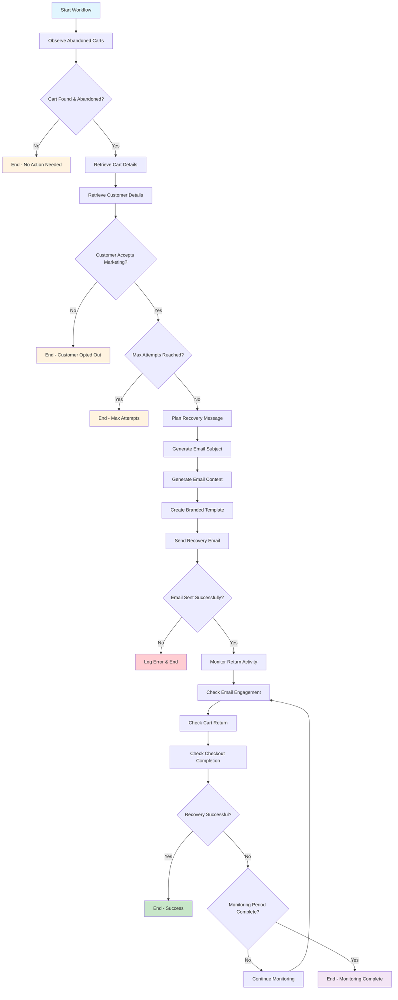

# LangGraph Workflow Diagram

## Abandoned Cart Recovery Agent State Flow



## State Definitions

### AgentState Structure

```python
class AgentState(BaseModel):
    # Input data
    cart: Optional[Cart] = None
    customer: Optional[Customer] = None
    
    # Processing state
    abandonment_minutes: int = 0
    is_abandoned: bool = False
    should_send_recovery: bool = False
    
    # Generated content
    recovery_message: Optional[str] = None
    email_subject: Optional[str] = None
    email_html_content: Optional[str] = None
    
    # Tracking
    recovery_attempts: List[RecoveryAttempt] = Field(default_factory=list)
    current_attempt: Optional[RecoveryAttempt] = None
    
    # Monitoring
    returned_to_cart: bool = False
    checkout_completed: bool = False
    recovery_successful: bool = False
    
    # Metadata
    workflow_started_at: Optional[datetime] = None
    workflow_completed_at: Optional[datetime] = None
    error_message: Optional[str] = None
```

## Node Functions

### 1. Observe Abandoned Carts
- **Purpose**: Monitor Shopify for carts abandoned for 15+ minutes
- **Input**: Empty state or configuration
- **Output**: Cart data and abandonment status
- **API Calls**: Shopify Admin API `/checkouts.json`

### 2. Retrieve Cart Details  
- **Purpose**: Enrich cart data with customer information
- **Input**: Basic cart information
- **Output**: Complete cart and customer data
- **API Calls**: Shopify Admin API `/customers/{id}.json`

### 3. Plan Recovery Message
- **Purpose**: Generate personalized email content using GPT-4
- **Input**: Cart and customer data
- **Output**: Email subject, content, and HTML template
- **API Calls**: OpenAI GPT-4 API

### 4. Send Recovery Email
- **Purpose**: Deliver email via SendGrid with tracking
- **Input**: Generated email content and customer data
- **Output**: Email delivery status and tracking information
- **API Calls**: SendGrid Mail API

### 5. Monitor Return Activity
- **Purpose**: Track customer engagement and return behavior
- **Input**: Email delivery confirmation
- **Output**: Recovery success status and engagement metrics
- **API Calls**: Shopify Admin API, SendGrid Event API

## Conditional Logic

### Should Proceed with Cart?
```python
def _should_proceed_with_cart(self, state: AgentState) -> str:
    if state.error_message:
        return "skip"
    if not state.is_abandoned:
        return "skip"
    if not state.cart:
        return "skip"
    return "proceed"
```

### Should Send Recovery?
```python
def _should_send_recovery(self, state: AgentState) -> str:
    if state.error_message:
        return "skip"
    if not state.customer:
        return "skip"
    if not state.customer.accepts_marketing:
        return "skip"
    if len(state.recovery_attempts) >= 3:
        return "skip"
    return "send"
```

## Error Handling

The workflow implements comprehensive error handling at each node:

- **API Failures**: Retry logic with exponential backoff
- **Data Validation**: Pydantic model validation at state transitions
- **Timeout Handling**: Configurable timeouts for external API calls
- **Graceful Degradation**: Fallback to mock data in development mode

## Monitoring and Observability

Each node includes detailed logging and metrics collection:

- **Execution Time**: Track node processing duration
- **Success Rates**: Monitor node success/failure rates
- **State Transitions**: Log all state changes for debugging
- **External API Metrics**: Track API response times and error rates

## Configuration Options

The workflow supports extensive configuration:

```python
config = {
    "abandonment_minutes": 15,
    "max_recovery_attempts": 3,
    "monitoring_duration_hours": 24,
    "use_mock_data": False,
    "openai_model": "gpt-4",
    "email_template_version": "v1"
}
```

## Deployment Considerations

### Memory Management
- State checkpointing for long-running workflows
- Configurable memory cleanup for completed workflows
- Efficient state serialization for distributed deployment

### Scalability
- Parallel execution of multiple cart recovery workflows
- Load balancing across multiple agent instances
- Queue-based processing for high-volume scenarios

### Reliability
- Persistent state storage for workflow recovery
- Dead letter queues for failed workflows
- Health checks and automatic restart capabilities

